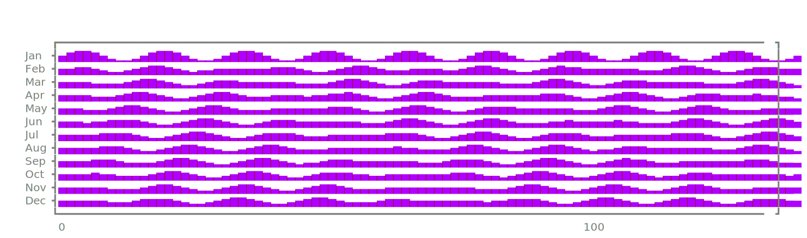
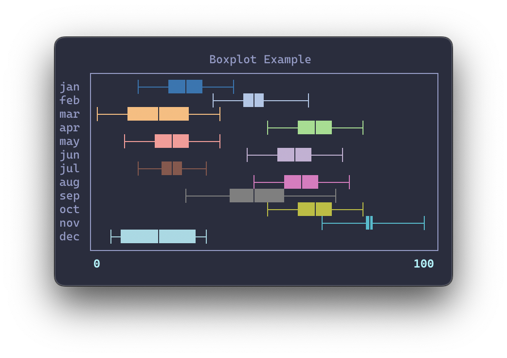
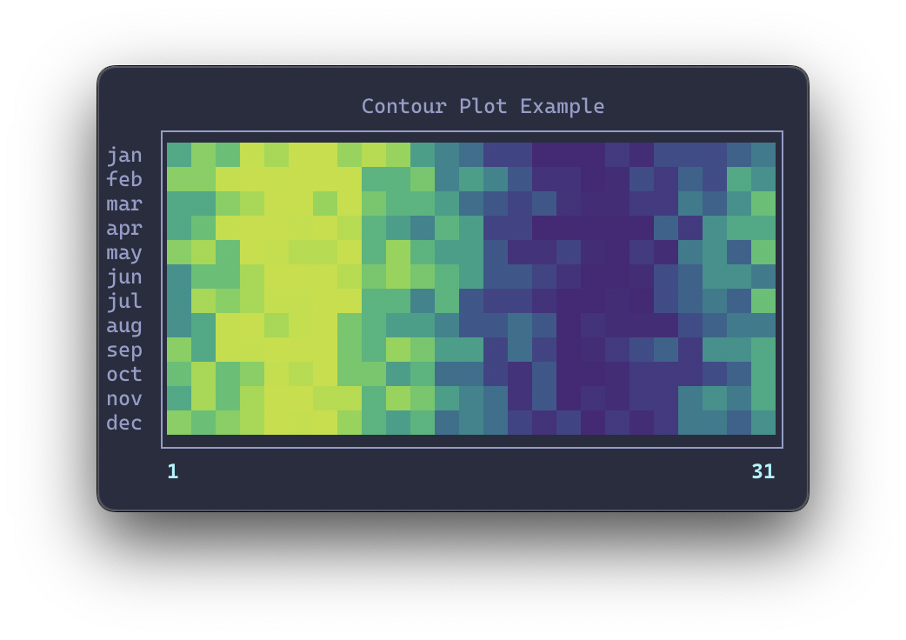

# Graphical

Graphical is a Python library that adds graphs and visuals to [Rich][rich] and [Textual][textual].

## Graphical Library

### Sparkline

### Ridgeline

## Similar Projects

- [asciichart][asciichart]: beautiful line plots
- [termplotlib][termplotlib]: line plots and histograms with a matplotlib feel
- [termgraph][termgraph]: bar and calendar graphs
- [termcharts][termcharts]: bar, pie and doughnut charts made for Rich
- [plotext][plotext]: plots and images with rich integration
- [plotille][plotille]: plots, histograms and images
- [termplot][termplot]: simple plots that can be used in Rich
- [terminalplot][terminalplot]: minimalistic plots
- [drawille][drawille]: drawing in Braille characters
- [gantt][gantt]: gantt charts

## More Graph Ideas

This is a list of textual sketches of different graph types that are also candidates for future implementation.

### Row-based Graphs

#### Bar Chart

#### Double Bar Chart

#### Stacked Bar Chart

#### Boxplot

#### Gantt Chart

#### Candlestick Chart

#### Contour Plot

### Complex Graphs

#### Histogram

#### Dendogram

#### Icicle Chart

#### Heatmap

#### Calendar

[rich]: https://github.com/Textualize/rich
[textual]: https://github.com/Textualize/textual
[asciichart]: https://github.com/kroitor/asciichart
[termplotlib]: https://github.com/nschloe/termplotlib
[termgraph]: https://github.com/mkaz/termgraph
[termcharts]: https://github.com/Abdur-rahmaanJ/termcharts
[plotext]: https://github.com/piccolomo/plotext
[plotille]: https://github.com/tammoippen/plotille
[termplot]: https://github.com/justnoise/termplot
[terminalplot]: https://github.com/kressi/terminalplot
[drawille]: https://github.com/asciimoo/drawille
[gantt]: https://github.com/andrew-ls/gantt