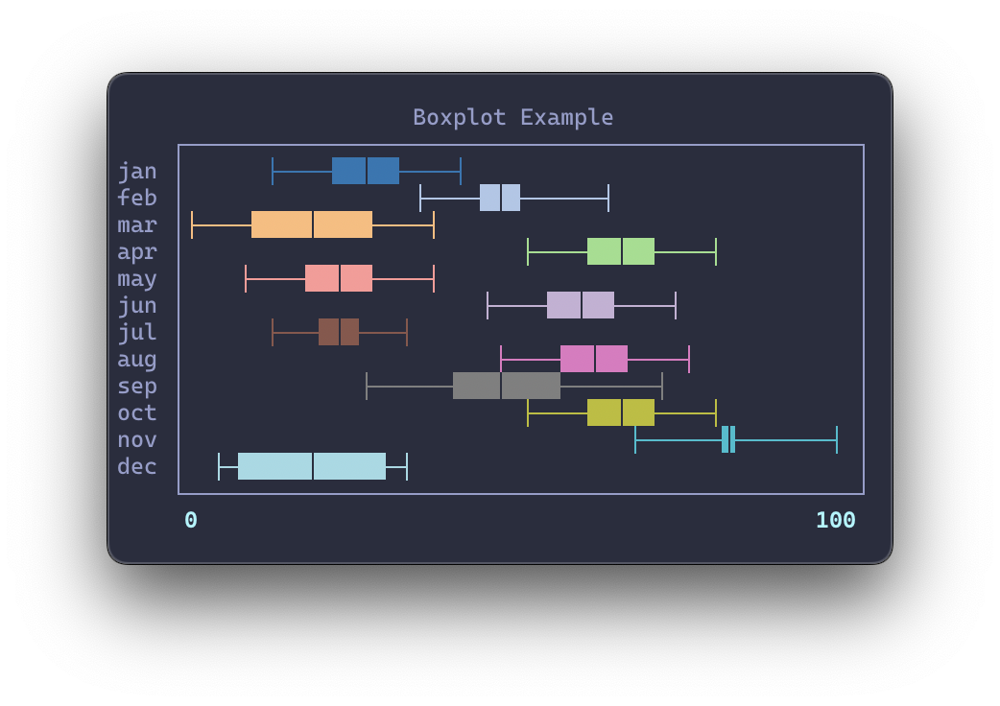
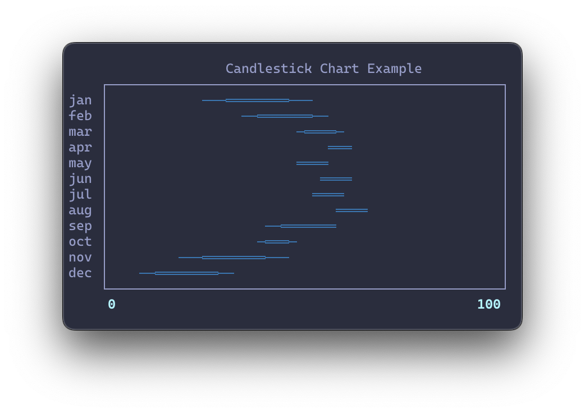
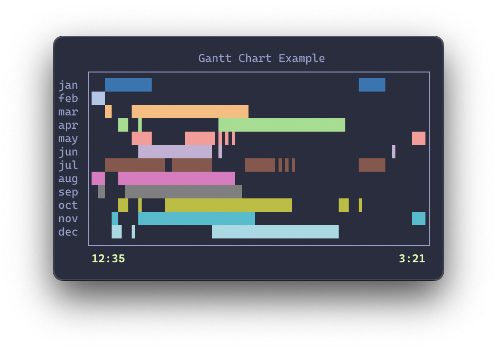
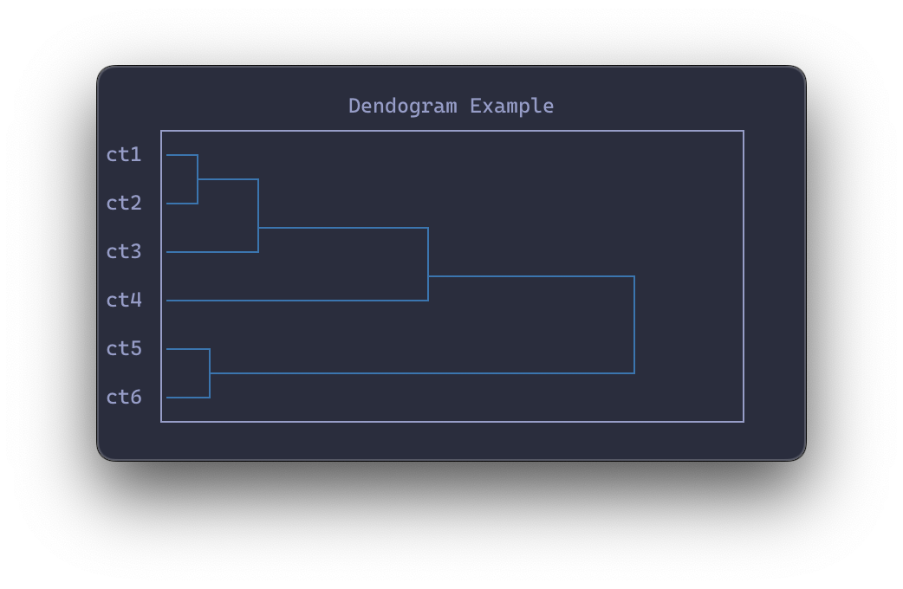
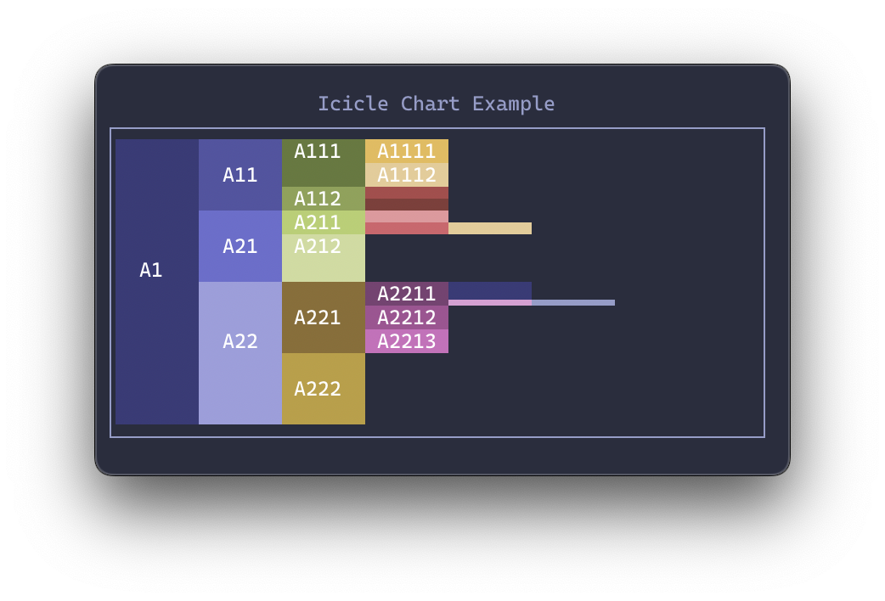
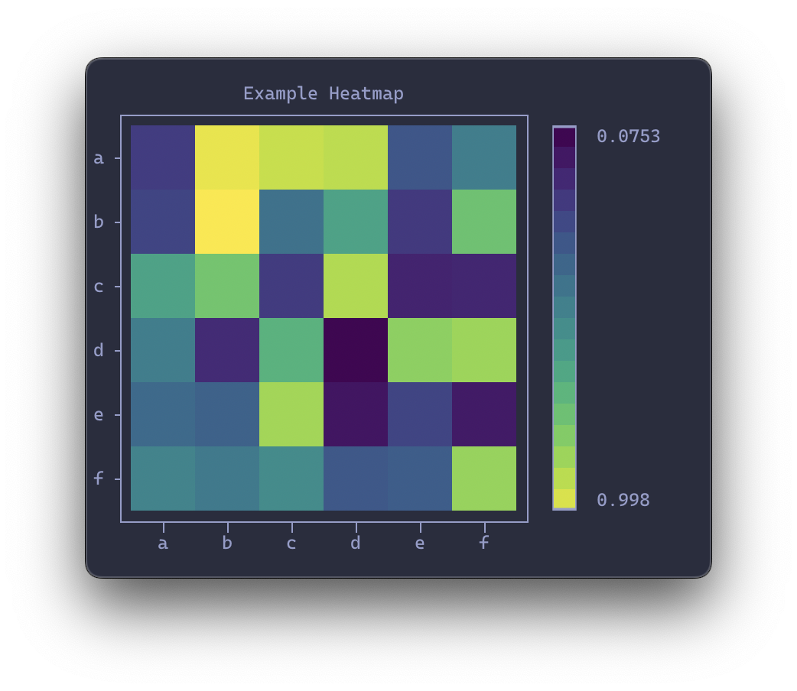
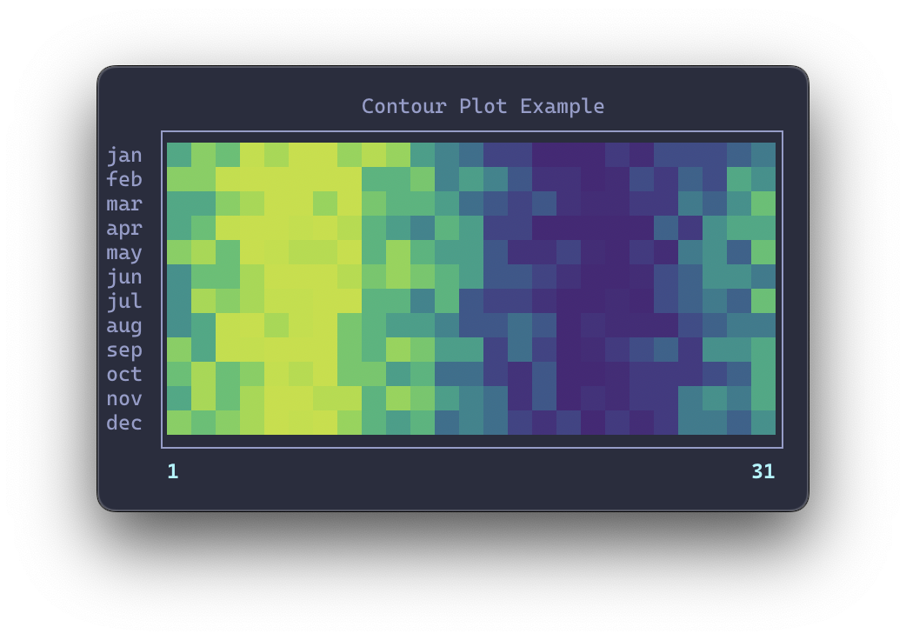
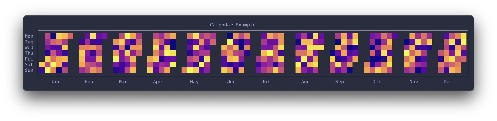

# Roadmap

Graphical is still very much in flux. 
For now, this is more of a collection of ideas and aspirations.
Ideas that are beyond the realm of rich might move to a separate library for textual.

## Features

- [ ] Gradient Fill
- [ ] Live Graph
- [ ] Highlight

## Elements

Elements are building blocks for adapting existing graphs and composing new ones.

- [x] Cell
    - [x] Shade
    - [ ] Color
    - [x] Horizontal
    - [x] Vertical
- [ ] Scale
- [ ] Axis
- [ ] Legend
- [ ] Caption

## Graphs

Graphical provides a number ready-to-use implementations of common graph types.
The focus lies on graphs that can provide a reasonable amount of accuracy within the limitations of unicode character representation.

Regular line plots are already well covered by other (rich/textual-ready) libraries and are currently not on the radar for graphical.

- [x] Sparkline
- [x] Ridgeline
- [x] Bar Chart
    - [x] Basic
    - [x] Diverging
    - [x] Stacked
    - [x] Double
    - [ ] Histogram
- [ ] Boxplot 

    {width="300"}

- [ ] Candlestick Chart

    {width="300"}

- [ ] Gantt Chart

    {width="300"}

- [ ] Dendogram

    {width="300"}

- [ ] Icicle Chart

    {width="300"}

- [ ] Heatmap

    {width="300"}

- [ ] Contour Plot

    {width="300"}

- [ ] Calendar

    {width="700"}
